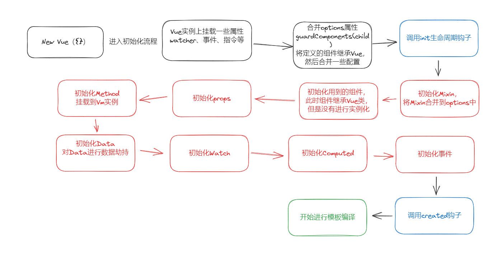

### 概述
&emsp;&emsp;这是一道 vue 的面试题，下面会结合部分源码对初始化流程展开讲解。
#### 首先会注册全局的指令、插件、Mixin等：
```js
initMixin(Vue)
stateMixin(Vue)
eventsMixin(Vue)
lifecycleMixin(Vue)
renderMixin(Vue)
```
#### 合并options属性，让组件继承Vue实例

#### 调用_init方法，正式进入组件初始化阶段
```js
export function initMixin (Vue: Class<Component>) {
  Vue.prototype._init = function (options?: Object) {
    const vm: Component = this
    // a uid
    vm._uid = uid++
    initLifecycle(vm)
    initEvents(vm)
    initRender(vm)
    callHook(vm, 'beforeCreate')
    initInjections(vm) // resolve injections before data/props
    initState(vm)
    initProvide(vm) // resolve provide after data/props
    callHook(vm, 'created')
  }
}
function Vue (options) {
  if (process.env.NODE_ENV !== 'production' &&
    !(this instanceof Vue)
  ) {
    warn('Vue is a constructor and should be called with the `new` keyword')
  }
  this._init(options)
}
export Vue
```
#### 初始化组件级mixin，合并到options中

#### 初始化子组件，让其继承Vue实例
调用guradComponents方法，继承Vue实例

#### 初始化props
遍历组件中的props属性，然后把父组件传过来的props添加到组件实例上的&props里

#### 初始化methods
遍历组件中的methods属性，把所有方法添加到该组件的实例上

#### 初始化Data,进行数据劫持

#### 流程图
&emsp;&emsp;下面是一张vue详细的初始化流程图：
